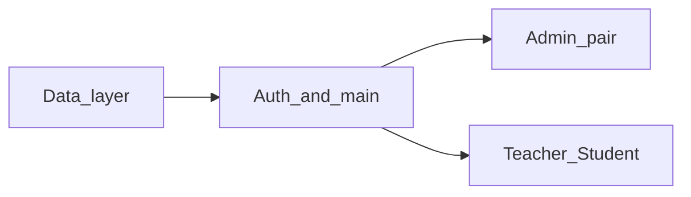

# Распределение работы в команде (5 человек)

Референсный код уже есть в репозитории; задача команды — **переписать и объяснить его с пониманием** (отчёт, защита), а не слепой копипаст.

## Как работать с референсом

1. Прочитать свой модуль и соседние слои (кто кого вызывает).
2. Кратко описать поток данных (схема или текст) — достаточно для отчёта.
3. Переписать код **своими словами** и структурой; при совпадении с референсом — вы должны всё равно объяснять каждое решение.
4. Проверить сценарии вручную (сборка и запуск — [run.md](run.md), тестовые логины — [README.md](README.md)).

## Порядок интеграции

1. **Сначала** слой данных: `DatabaseManager`, модели, `data/*.json` — без этого остальные модули не к чему подключать.
2. **Затем** вход: `main.cpp`, окно логина, `AuthController`.
3. **Параллельно** (когда п.1–2 стабильны или есть согласованные заглушки): админка (пара) и панели преподавателя/студента.

## Роли и файлы

| Участник | Зона | Основные файлы |
|----------|------|----------------|
| **1** | Данные: singleton, JSON, сущности | `database/databasemanager.*`, `models/*`, `data/*.json` |
| **2** | Точка входа и авторизация | `main.cpp`, `views/loginwindow.*`, `controllers/authcontroller.*` |
| **3 и 4 (пара)** | Администратор | `views/adminpanel.*`, `controllers/usercontroller.*`, `controllers/coursecontroller.*` |
| **5** | Преподаватель и студент | `views/teacherpanel.*`, `views/studentpanel.*`, `controllers/gradecontroller.*` |

### Пара на админке (участники 3 и 4)

- Работайте в **одной ветке** (например `feature/admin-rewrite`), договоритесь, кто пишет коммит в какой момент (парное программирование или чёткие подзадачи по дням).
- Логичное деление внутри пары: один ведёт **пользователей** и `UserController`, второй — **курсы и записи на курсы** и `CourseController`; при этом **один** файл `adminpanel.cpp` общий — синхронизируйтесь, чтобы не затереть изменения.

### Общие файлы

`StudyTable.pro`, `resources.qrc`, `resources/styles/main.qss` — правки по необходимости; удобно повесить на **участника 2** (оболочка приложения) или договориться в чате перед merge.

## Критерии готовности («с пониманием»)

- В PR или отчёте: коротко **кто кого вызывает** в вашей части (окно → контроллер → `DatabaseManager` → JSON).
- Ручной прогон сценариев для своей роли в приложении.
- Нет фрагментов вида «не знаю, зачем это» — либо разобрали, либо упростили.

## Git

| Кто | Ветка (пример) |
|-----|----------------|
| 1 | `feature/data-layer` |
| 2 | `feature/auth-login` |
| 3 + 4 | одна общая, напр. `feature/admin-rewrite` |
| 5 | `feature/teacher-student` |

В `main` сливать после ревью; участникам 2–5 проще стартовать, когда у участника 1 есть рабочие модели и методы `DatabaseManager` (или явно описанный контракт).
