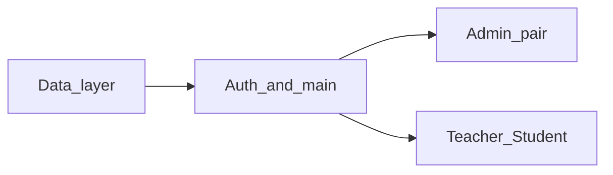

# Распределение работы в команде (5 человек)

Корень проекта — **папка репозитория** (там лежит `StudyTable.pro`). Все пути ниже **относительные от этого корня**.

Референсный код уже есть; задача — **переписать и объяснить с пониманием**, а не копировать. Ниже указано **где какие файлы лежат** и **что вам можно менять**, чтобы случайно не править чужие модули.

---

## Карта репозитория (что вообще есть)

Структура, с которой работает qmake ([`StudyTable.pro`](StudyTable.pro)):

```
OOP-project/                          ← корень (ваш клон с GitHub)
├── StudyTable.pro                    ← список исходников для сборки
├── main.cpp                          ← точка входа, QApplication
├── resources.qrc                     ← подключение ресурсов (стили)
├── README.md                         ← описание проекта (документация)
├── run.md                            ← как собрать и запустить
├── TEAM.md                           ← этот файл
├── knowledge.txt                     ← конспект C++ (ориентир по уровню)
│
├── database/
│   ├── databasemanager.h
│   └── databasemanager.cpp           ← Singleton, чтение/запись JSON
│
├── models/
│   ├── user.h          user.cpp      ← сущность «пользователь»
│   ├── course.h        course.cpp    ← «курс»
│   ├── grade.h         grade.cpp     ← «оценка»
│   └── enrollment.h    enrollment.cpp← «запись студента на курс»
│
├── controllers/
│   ├── authcontroller.h   authcontroller.cpp    ← проверка логина/пароля
│   ├── usercontroller.h   usercontroller.cpp    ← логика пользователей (для админа)
│   ├── coursecontroller.h coursecontroller.cpp← логика курсов (для админа)
│   └── gradecontroller.h  gradecontroller.cpp ← логика оценок
│
├── views/
│   ├── loginwindow.h    loginwindow.cpp         ← окно входа
│   ├── adminpanel.h     adminpanel.cpp          ← панель администратора
│   ├── teacherpanel.h   teacherpanel.cpp        ← панель преподавателя
│   └── studentpanel.h   studentpanel.cpp        ← панель студента
│
├── data/                             ← JSON с данными приложения
│   ├── users.json
│   ├── courses.json
│   ├── grades.json
│   └── enrollments.json
│
└── resources/
    └── styles/
        └── main.qss                  ← оформление (как CSS для Qt)
```

Служебные папки вроде `build/` при сборке могут появиться локально — **в Git их обычно не коммитят**; исходники вы правите только в дереве выше.

---

## Участник 1 — данные (модели, JSON, DatabaseManager)

### Ваши файлы (переписываете в первую очередь именно их)

| Путь | Назначение |
|------|------------|
| `database/databasemanager.h` | Объявление класса-singleton, методы load/save, работа с путями к `data/` |
| `database/databasemanager.cpp` | Реализация: `QJsonDocument`, списки, CRUD по сущностям |
| `models/user.h` | Поля пользователя, геттеры/сеттеры, при необходимости `fromJson` / `toJson` |
| `models/user.cpp` | Реализация `User` |
| `models/course.h` | Курс |
| `models/course.cpp` | |
| `models/grade.h` | Оценка |
| `models/grade.cpp` | |
| `models/enrollment.h` | Запись на курс |
| `models/enrollment.cpp` | |
| `data/users.json` | Тестовые пользователи |
| `data/courses.json` | Курсы |
| `data/grades.json` | Оценки |
| `data/enrollments.json` | Записи студентов на курсы |

### Чужие файлы — не менять без договорённости с командой

Всё в `views/`, всё в `controllers/`, `main.cpp`, `resources.qrc`, `resources/styles/main.qss`, `StudyTable.pro` — **не ваши**, пока не согласовали (например, если добавили новый `.cpp` и нужно прописать его в `.pro` — это обычно делает тот, кто добавляет файл, с уведомлением всех).

---

## Участник 2 — вход в приложение и авторизация

### Ваши файлы

| Путь | Назначение |
|------|------------|
| `main.cpp` | `QApplication`, загрузка стиля из ресурса, создание и показ `LoginWindow` |
| `views/loginwindow.h` | Класс окна входа |
| `views/loginwindow.cpp` | Поля логин/пароль, кнопка, вызов `AuthController`, открытие нужной панели по роли |
| `controllers/authcontroller.h` | Проверка учётных данных |
| `controllers/authcontroller.cpp` | Обычно запрос пользователей через `DatabaseManager`, сравнение логина/пароля |

### Часто ваши же правки (оболочка приложения)

| Путь | Когда трогать |
|------|----------------|
| `resources.qrc` | Если меняете пути к стилям или добавляете ресурсы |
| `resources/styles/main.qss` | Глобальное оформление (можно договориться с командой, чтобы не конфликтовать) |
| `StudyTable.pro` | Редко: если добавляете **новые** `.cpp`/`.h` в проект (сейчас все уже перечислены) |

### Чужие файлы

`database/*`, `models/*`, `data/*` — **читаете** как API, не переписываете чужую логику без участника 1.  
`adminpanel`, `teacherpanel`, `studentpanel`, `usercontroller`, `coursecontroller`, `gradecontroller` — **не ваши**.

---

## Участники 3 и 4 — пара, администратор

Одна ветка, один общий большой файл UI — **договоритесь о времени коммитов**, чтобы не затереть друг друга.

### Файлы пары (переписываете вместе / делите зону внутри файла)

| Путь | Назначение |
|------|------------|
| `views/adminpanel.h` | Класс панели админа, слоты, указатели на виджеты |
| `views/adminpanel.cpp` | Вкладки/таблицы: пользователи, курсы, записи на курсы, диалоги |
| `controllers/usercontroller.h` | Логика вокруг пользователей (список, добавление, обновление, удаление через БД) |
| `controllers/usercontroller.cpp` | |
| `controllers/coursecontroller.h` | Логика курсов и связанных операций |
| `controllers/coursecontroller.cpp` | |

**Типичное деление внутри пары:**

- Участник **3**: в основном `usercontroller.*` + методы/слоты админки, которые работают **только с пользователями**.
- Участник **4**: в основном `coursecontroller.*` + часть админки про **курсы и enrollments** (запись студента на курс и т.д.).

Оба **читают и правят** `adminpanel.*`, но **не одновременно в одних и тех же строках** — синхронизация в чате или пара программирования.

### Чужие файлы

- `loginwindow.*`, `authcontroller.*`, `main.cpp` — участник 2.  
- `teacherpanel.*`, `studentpanel.*`, `gradecontroller.*` — участник 5.  
- `databasemanager.*`, `models/*`, `data/*` — участник 1 (админка только **вызывает** уже готовые методы; если не хватает метода в `DatabaseManager` — согласовать с участником 1).

---

## Участник 5 — преподаватель и студент

### Ваши файлы

| Путь | Назначение |
|------|------------|
| `views/teacherpanel.h` | Панель преподавателя |
| `views/teacherpanel.cpp` | Курсы преподавателя, таблица студентов, выставление оценок |
| `views/studentpanel.h` | Панель студента |
| `views/studentpanel.cpp` | Список курсов студента, оценки, статистика |
| `controllers/gradecontroller.h` | Операции с оценками через слой данных |
| `controllers/gradecontroller.cpp` | |

### Чужие файлы

`adminpanel.*`, `usercontroller.*`, `coursecontroller.*` — не ваши.  
`loginwindow.*`, `authcontroller.*`, `main.cpp` — не ваши.  
`database/*`, `models/*`, `data/*` — не переписываете чужую реализацию; при необходимости нового запроса к данным — с участником 1.

---

## Сводная таблица «кто чей код трогает»

| Папка / файл | Уч.1 | Уч.2 | Уч.3–4 | Уч.5 |
|--------------|:----:|:----:|:------:|:----:|
| `database/` | да | нет | нет | нет |
| `models/` | да | нет | нет | нет |
| `data/*.json` | да | нет | нет* | нет* |
| `main.cpp` | нет | да | нет | нет |
| `views/loginwindow.*` | нет | да | нет | нет |
| `controllers/authcontroller.*` | нет | да | нет | нет |
| `views/adminpanel.*` | нет | нет | да | нет |
| `controllers/usercontroller.*` | нет | нет | да | нет |
| `controllers/coursecontroller.*` | нет | нет | да | нет |
| `views/teacherpanel.*` | нет | нет | нет | да |
| `views/studentpanel.*` | нет | нет | нет | да |
| `controllers/gradecontroller.*` | нет | нет | нет | да |
| `resources.qrc`, `resources/styles/main.qss` | нет | чаще всего да** | по договорённости | нет |
| `StudyTable.pro` | при новых файлах | при новых файлах | при новых файлах | при новых файлах |

\* Только тестовые правки по сценарию, **согласовав** с участником 1.  
\*\* Или общая полировка в конце спринта.

Если нужно изменить «чужой» файл (например, добавить метод в `DatabaseManager`) — **напишите в чат / issue**, коротко опишите контракт метода, согласуйте с владельцем зоны.

---

## Порядок интеграции

1. **Участник 1** — стабильные модели, JSON и `DatabaseManager`.  
2. **Участник 2** — `main` + логин + `AuthController`.  
3. **Пара 3–4** и **участник 5** — после того как можно вызывать БД и войти в систему (или по согласованным заглушкам).



---

## Как работать с референсом

1. Открыть **только свои** пути из таблиц выше.  
2. Описать поток: окно → контроллер → `DatabaseManager` → файл в `data/`.  
3. Переписать код с пониманием; проверить сценарии ([run.md](run.md), логины в [README.md](README.md)).

## Критерии готовности

- В отчёте/PR: кто кого вызывает в вашей части.  
- Ручной прогон сценариев для своей роли.  
- Нет кусков «не знаю зачем» без разбора.

## Git (пример веток)

| Участник | Ветка (пример) |
|----------|----------------|
| 1 | `feature/data-layer` |
| 2 | `feature/auth-login` |
| 3 + 4 | одна, напр. `feature/admin-rewrite` |
| 5 | `feature/teacher-student` |

Слияние в `main` после ревью.
